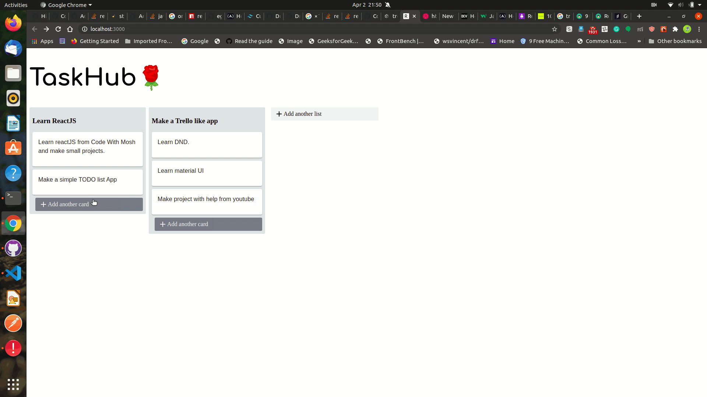

#**TaskHub:orangutan:**

###Trello-like clone 
## Features
* add to list 
* Add cards
* Drag and drop using react-beautiful-dnd
* Local storage
  

##Steps to run Project:
* Clone project
`git clone https://github.com/aakankshadhurandhar/rello.git`
* go to project directory and start the project
  `cd rello`
* Start react app
   `npm start`

#[live website](https://taskhub.netlify.app/)

